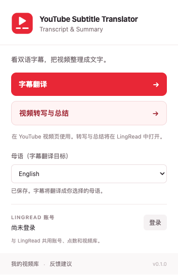

# YouTube Subtitle Translator, Transcript & Summary

专注 YouTube 字幕翻译、视频转写与总结的 Chrome 扩展。它是 LingRead 的独立客户端，与 LingRead 共用用户、登录、点数、视频库、网站和管理后台。

## 功能与范围

- 在 YouTube 播放器中使用双语字幕或仅译文，按音轨及 ASR 信息选择视频原语言，读取已有翻译并跟踪后台翻译任务。
- 首次安装时选择母语，默认简体中文；可在插件弹窗或扩展选项中随时修改。支持英语、日语等 16 种字幕目标语言。
- 把视频字幕整理为可阅读的文章，查看导读与要点总结。
- 使用 LingRead 登录页同步账号。网站已登录时会自动同步，无需另建账号。
- 未翻译的视频在播放器内显示预估扣点，确认后启动翻译，原地显示进度；后台详情由用户选择打开。译文缺失的已扣点失败任务可继续翻译，不重复扣点；如果仅后续处理失败、译文已完整，则直接加载字幕，无需续跑。
- 视频转写与总结仍使用中文，依赖视频可读取的字幕轨，不包含无字幕视频的语音识别。
- 仅支持 Chrome MV3；支持标准 YouTube watch 页面及嵌入播放器。移动网页支持取决于其播放器 DOM，未承诺 Shorts 支持。

## 安装与开发

需要 Node.js 20.19+（建议 22 或 24）和 Chrome 120+。

```sh
npm ci
npm test
npm run check
npm run build:dev
```

打开 `chrome://extensions`，开启开发者模式，加载已解压的扩展，选择本项目 `dist/development`（也可直接加载 `extension`）。开发配置连接 LingRead 的 `http://localhost:3100` 网站和 `http://localhost:4100` API，服务仍由 LingRead 仓库的 `./dev.sh` 启动。

连接线上 LingRead：

```sh
npm run build
```

加载 `dist/production`。可分发的 ZIP 位于 `dist/youtube-subtitle-translator-0.1.0-production.zip`。生产包连接 `https://lingread.app`，不会修改源配置或 LingRead 的下载文件。

首次安装会打开母语设置页。安装后刷新现有 YouTube 标签页。点击播放器中的“字幕翻译”、视频操作区的“视频转写与总结”，或浏览器工具栏弹窗中的相应按钮。双语显示原文和母语译文；原语言与母语相同时只显示原文，避免重复。未翻译时先在视频页确认预估点数，完成后沿用当前显示模式，也可切换双语或仅译文。转写、总结与视频库使用 LingRead 现有网站。

快捷键：`Alt+Shift+Y` 打开字幕面板，`Alt+Shift+B` 切换字幕模式；与旧客户端快捷键隔离。

## 浏览器验证

```sh
npm exec playwright-core install chromium --no-shell
npm run build
npm run test:browser
```

使用临时 Chrome for Testing 配置加载真实扩展，验证母语设置与持久化、弹窗、登录状态、非视频页提示，以及网站登录事件到扩展的完整桥接。登录页、视频页和字幕接口使用受控模拟响应，验证确认、取消、进度、字幕完成与模式切换，不使用真实账号或消耗点数；不会连接个人 Chrome 配置。脚本生成弹窗及字幕确认、进度、完成截图。



## 共享登录的含义

账号、计费与服务端数据完全相同。Chrome 会隔离两个扩展的本地存储，因此首次使用新扩展需要点击“登录”同步一次。新扩展建立自己的 relay 会话，不会复用另一扩展的登录标签页。退出此扩展只清除此扩展的本地登录，不会退出 LingRead 网站或另一个客户端。

登录桥接只在 LingRead 登录页运行。后台检查回调来源、顶层 frame、待登录 tab 和 relay ID；MV3 worker 重启后通过持久化状态和 alarm 恢复轮询。

## 拆分与兼容

代码来自 LingRead `2524101` 的 `browser-extension/content-youtube*.js`。迁移保留字幕行为及对应测试，替换品牌与 DOM/事件命名空间，新的后台仅处理视频 API、登录和导航。

复用现有 LingRead 网站、接口、数据库与管理后台。视频页扣点确认需要部署新增的只读 `POST /api/youtube/subtitle/quote` 接口，多语言字幕需要部署 LingRead 后端的目标语言提示词支持；接口字段和简体中文默认行为保持兼容，无需数据库迁移。LingRead 扩展从 1.9.19 起已移除旧 YouTube 脚本、入口与补注入，并对独立客户端的登录页做会话隔离，可以与本扩展同时启用。

更新或重新加载 LingRead 后，请刷新已打开的 YouTube 标签页及含 YouTube 播放器的网页，以清除页面中残留的旧脚本。若仍在使用 1.9.18 或更早的 LingRead，测试时先停用旧扩展。服务端继续保留兼容旧版本客户端的接口。

## 文件结构

- `extension/`：完整扩展运行时，不依赖兄弟仓库路径或构建时读取 LingRead。
- `extension/lib/`：账号同步、API 代理、导航与播放器脚本注入。
- `extension/icons/logo.svg`：红色播放与字幕图标源；`npm run icons` 重新生成 PNG。
- `tests/`：API、登录、字幕时序、字幕模式与字体回归测试。
- `scripts/`：资源检查、图标生成、独立打包。
- `docs/`：拆分设计、实施计划、验证记录。

图标采用红色播放与字幕元素。产品由 LingRead 提供，与 YouTube/Google 无官方关联。
